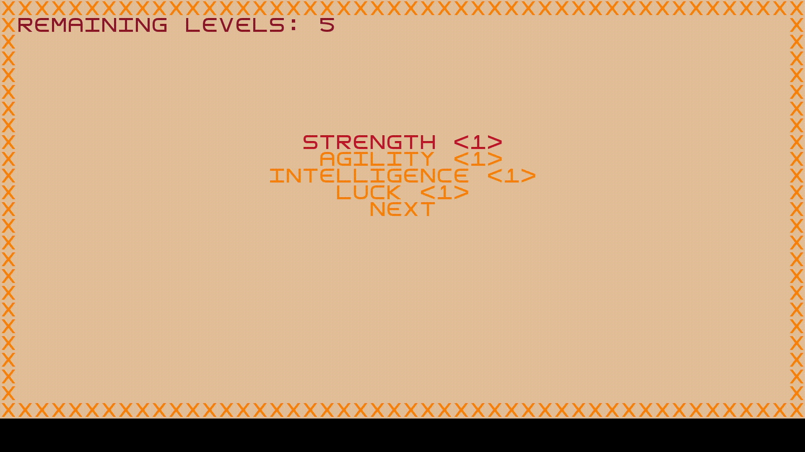

# LPOO: Fallout - a post pandemic RPG

## Introduction
The game with developped assimilates to the original Fallout: a classic RPG, where the main charachter, Vault Boy, fights enemies in a turn based combat mode, levels up, explores arenas and beats the game. 

## Description
The charachter is dropped in a space full of enemies. It must fight, and win, to move on with the game. A battle starts when he gets too close to a monster. The battle is formatted in a turn based combat style. Every turn, the user is presented with a multitude of options like intimidating it's enemies or defend attacks. But beware, enemies can use this tools too.

## Small Demonstration

  

