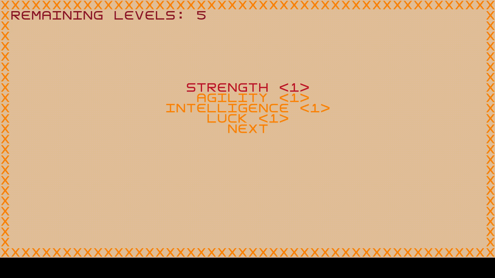
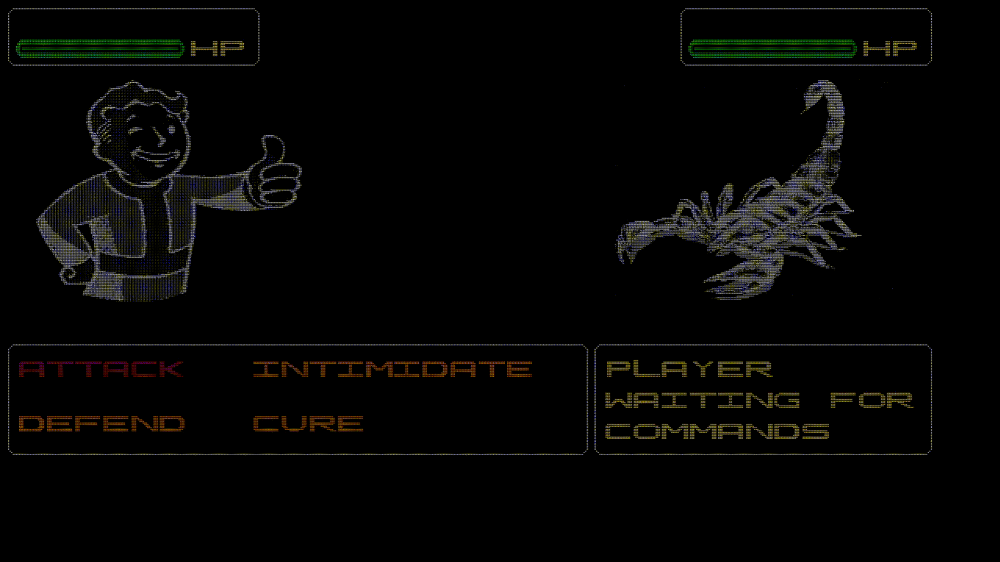
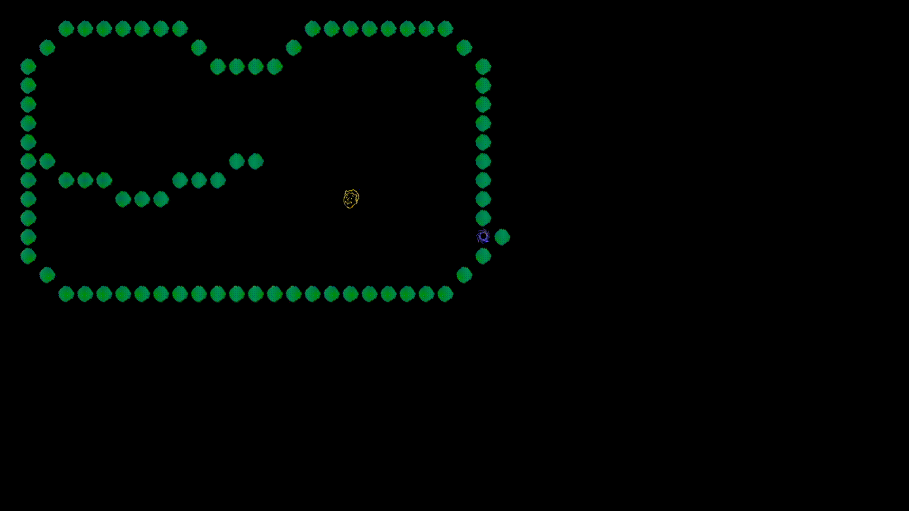
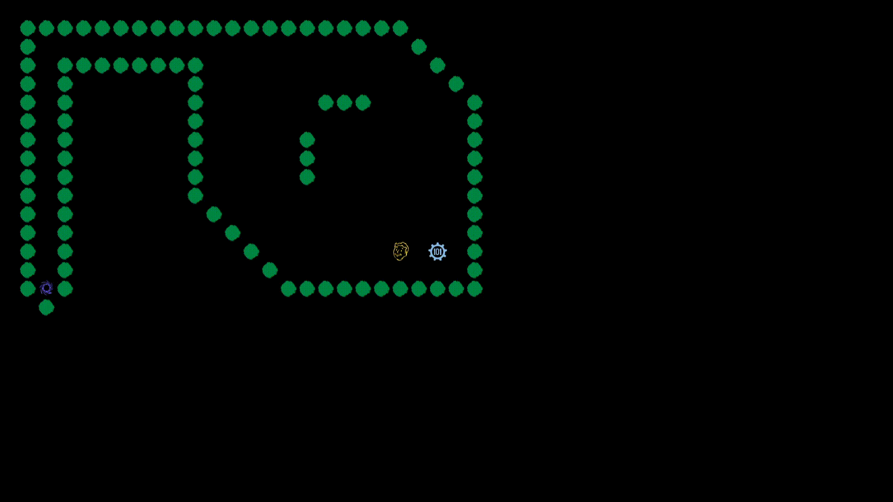
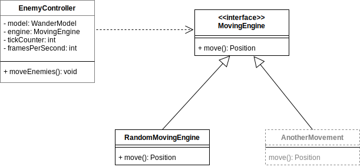
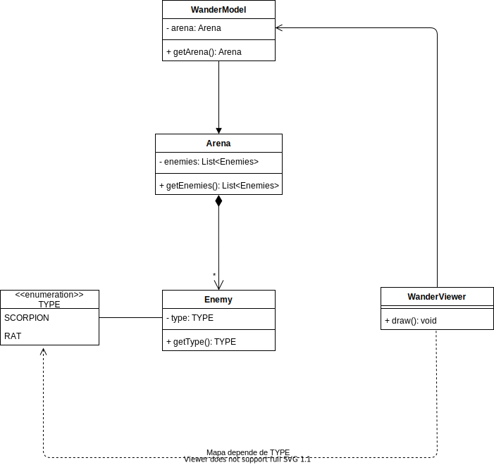
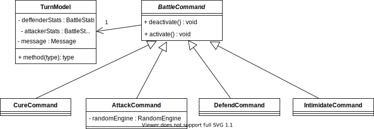
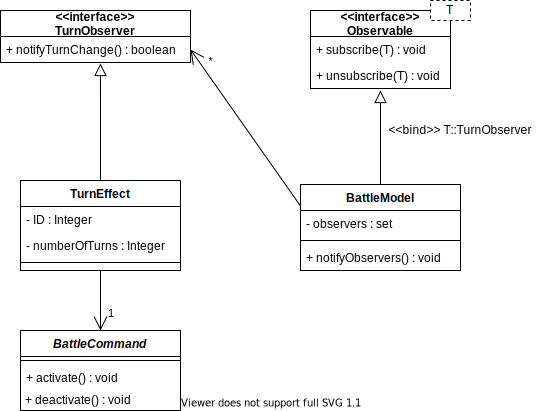
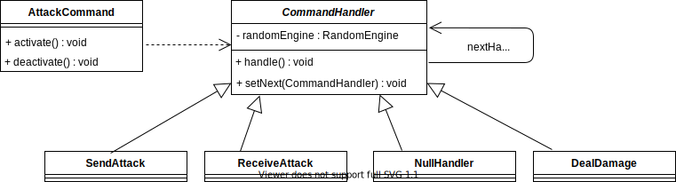

# **LPOO - Fallout: A post pandemic RPG**

## Introduction
The game with developped assimilates to the original Fallout: a classic RPG, where the main charachter, Vault Boy, fights enemies in a turn based combat mode, levels up, explores arenas and beats the game. 

## Description
The charachter is dropped in a space full of enemies. It must fight, and win, to move on with the game. A battle starts when he gets too close to a monster. The battle is formatted in a turn based combat style. Every turn, the user is presented with a multitude of options like intimidating it's enemies or defend attacks. But beware, enemies can use this tools too.

## Small Demonstration

  

# Tabela de Conteúdos
- [**LPOO - Fallout: A post pandemic RPG**](#lpoo---fallout-a-post-pandemic-rpg)
  - [Introduction](#introduction)
  - [Description](#description)
  - [Small Demonstration](#small-demonstration)
- [Tabela de Conteúdos](#tabela-de-conteúdos)
- [Funcionalidades](#funcionalidades)
  - [Implementadas](#implementadas)
  - [Por implementar](#por-implementar)
- [Design](#design)
  - [Padrão Arquitetural](#padrão-arquitetural)
    - [Contexto do problema](#contexto-do-problema)
    - [Design Pattern](#design-pattern)
    - [Implementação](#implementação)
    - [Consequências](#consequências)
  - [Movimentação dos Personagens](#movimentação-dos-personagens)
    - [Contexto do problema](#contexto-do-problema-1)
    - [Design Pattern](#design-pattern-1)
    - [Implementação](#implementação-1)
    - [Consequências](#consequências-1)
  - [Estados distintos - Gráficos diferentes](#estados-distintos---gráficos-diferentes)
    - [Contexto do problema](#contexto-do-problema-2)
    - [Solução](#solução)
  - [Escolha do desenho das personagens](#escolha-do-desenho-das-personagens)
    - [Contexto do problema](#contexto-do-problema-3)
    - [Design pattern](#design-pattern-2)
    - [Implementação](#implementação-2)
    - [Consequências](#consequências-2)
  - [Group Renderers](#group-renderers)
    - [Contexto do problema](#contexto-do-problema-4)
    - [Design Pattern](#design-pattern-3)
    - [Implementação](#implementação-3)
    - [Consequeências](#consequeências)
  - [Menu - Opções disponíveis para o utilizador](#menu---opções-disponíveis-para-o-utilizador)
    - [Contexto do problema](#contexto-do-problema-5)
    - [Design Pattern](#design-pattern-4)
    - [Implementação](#implementação-4)
    - [Consequencias](#consequencias)
  - [Efeitos de Batalha](#efeitos-de-batalha)
    - [Contextualização do Problema](#contextualização-do-problema)
    - [Desing Pattern](#desing-pattern)
    - [Implementação](#implementação-5)
    - [Consequências](#consequências-3)
  - [Attack e Probabilidades](#attack-e-probabilidades)
    - [Contextualização do Problema](#contextualização-do-problema-1)
    - [Desing Pattern](#desing-pattern-1)
    - [Implementação](#implementação-6)
    - [Consequências](#consequências-4)
- [Code Smells](#code-smells)
  - [Dispensables - Data Class](#dispensables---data-class)
  - [Object-Orientation Abusers - Switch Statements](#object-orientation-abusers---switch-statements)
  - [Change Preventers - Divergent Change](#change-preventers---divergent-change)
  - [Couplers - Middle Man](#couplers---middle-man)

# Funcionalidades
  
## Implementadas
- Ecrã inicial: menu onde o jogador terá 5 pontos para distribuir pelos 4 atributos para poder criar o seu personagem

  

- Modo de batalha: modo onde é efetuada uma batalha por turnos contra um inimigo.

  

- Movimento do herói: o herói move-se pela arena e o seu movimento é controlado através de teclas do teclado
- Desenho do herói e da arena: a arena e os seus componentes (monstros e paredes), bem como o herói (Vault Boy), são desenhados no terminal do Lanterna
- Movimento dos monstros: os monstros movem-se na arena
- Deteção do inicio de batalha: quando o range do Vault Boy colide com o range de um monstro que esteja no seu campo de visão (sem paredes entre estes), a batalha inicia

  

 - Ficheiros de jogo: carregamento da arena e outras informações através de ficheiros de jogo
 - Transição entre arenas: existem mais do que uma arena e o jogador viaja entre elas através das suas portas

  

- Gravação de dados: o jogador pode guardar os dados da partida (em ficheiros) para que o jogo guarde o progresso
- Progressão do personagem: à medida que os inimigos são derrotados o nosso personagem acumula experiência que pode ser usada para melhorar os seus atributos

  

 - Jogo termina quando o jogador chega a um checkpoint: Se o jogador pisar a Vault Door na ultima sala é apresentada uma menssagem que anuncia a vitória

  

## Por implementar
- Menu de Wander: menu onde o jogador poderá editar o seu equipamento e arma, percorrer o seu inventário e obter outro tipo de informações
- Loot: Sistema de *loot* para que o jogador possa apanhar diferentes armas (e possivelmente equipamento) para lutar com os inimigos que encontrará
- Equipamentos: sistema de armaduras e outros equipamente que darão atributos bónus ao personagem (e possivelmente aos monstros)
- NPCs: o jogador poderá interagir com um personagem não jogável para trocar o dinheiro ganho em batalha por novas armas e armaduras

# Design

## Padrão Arquitetural
### Contexto do problema
O padrão arquitetural foi a primeira escolha feita no desenvolvimento do programa. A escolha do padrão arquitetural é de extrema importância porque dita a estrutura básica do programa.
### Design Pattern
Como padrão arquitetural foi utilizado uma combinação de MVC com *State Pattern*. Cada *State Pattern* contém um *MVC*. A classe ***Game*** contém uma *stack* de estados e cada vez que queremos trocar de estado basta mudar o topo da *stack*. O controller é uma classe genérica que recebe um *model*. O *viewer* recebe um *model* e uma interface do tipo ***GUI*** e o state apenas necessita do *model* porque a partir deste tanto o *viewer* como o *controller* podem ser gerados. 
### Implementação
Apenas foi apresentado um estado do jogo para simplificar o diagrama de classes. 

  

### Consequências
 - É mais fácil expandir o programa
 - Cada estado funciona isolado dos outros estados.
 - É mais fácil testar os componenetes individuais. Por exemplo textar o model de forma isolada do controller.
 - O mais simples menu necessita de pelo menos quatro classes para ser representado.
 - Preservação do Single Responsability Principle: cada state tem a sua classe
 - Preservação o Open-Closed Principle: a adição de novos states não afeta os states já existentes
 - Evita a utilização de máquinas de estados com condicionais complexos

## Movimentação dos Personagens
### Contexto do problema
Queriamos dar suporte tanto a estratégias de movimentação alternativas para poder suportar movimentações que considerem, por exemplo, as posições relativas dos elementos na arena. Para além disso, queriamos tornar mais fácil a testagem da movimentação dos personagens.

### Design Pattern
Para resolver este problema decidimos utilizar o *Strategy Pattern*, para que o nosso ***EnemyController*** possa receber uma *engine* de movimentação arbitrária.

### Implementação

  

### Consequências
 - Respeito do Open closed principle. Para adicionar uma estratégia de movimento basta criar uma nova subclasse.
 - Respeito do Dependency inversion principle. A nossa classe EnemyController depende de uma interface que define MovingEngine.
 - Código mais fácil de testar. Podemos criar mocks deterministicos de MovingEngine para realizar testes.

## Estados distintos - Gráficos diferentes
### Contexto do problema
O nosso jogo, como foi explicado anteriormente, pode ser dividido em vários estados. Em alguns, os requerimentos para a qualidade dos gráficos são diferentes: no estado Wander, semelhante à arena do hero, o tamanho dos componentes da cena permite que sejam representados apenas por simples carateres (chamemos a gráficos como estes *monocarater*); no entanto, no estado de batalha, consideramos que existe a necessidade de formar imagens de maior qualidade e formadas por vários carateres (designaremos estes gráficos como *multicarater*). Também havia a questão de como tornar estes dois estilos de gráficos diferentes minimamente agradáveis. 

### Solução
Decidimos que a melhor opção seria que o tamanho da letra e a resolução do terminal não poderiam ser as mesmas. Por esta razão, optámos por gerar um novo terminal no caso de entrada num modo que assim o necessite, com resolução e tamanho diferentes. Quanto à segunda fase do problema, e devido às limitações impostas pelo terminal a utilizar optámos por:
- recorrer ao uso de custom fonts para melhorar os gráficos *monocarater*
- formular imagens em formato ascii art através de conversores online no que toca aos gráficos *multicharater*. Escolhemos esta opção tendo em conta a sua relativa simplicidade mas decente qualidade.

## Escolha do desenho das personagens
### Contexto do problema
No nosso jogo, tanto no modo *monocharater* quanto no *multicharater* existe a necessidade de diferenciar os personagens.
Apesar do nosso jogo não utilizar uma framework de gráficos complexa, existe a necessidade de diferenciar os inimigos para perceber, por exemplo, que arma utiliazam ou quão fortes são.
Foram estudadas várias soluções para o problema, como por exemplo utilizar uma subclasse para cada personagem.

### Design pattern
Para este problema decidimos utilizar uma solução própria. Criámos uma enumeração que contem os tipos de inimigos que podem existir esta enumeração está armazenada na classe ***Enemy***. 
Para suportar esta forma de desenhar os inimigos cada *viewer* terá um mapa que, para cada tipo de inimigo retorna a forma de o desenhar naquele *viewer*.

### Implementação 

  

### Consequências
- Existe uma pequena violação do Open-Closed Principle, porque ao criar novos tipos de inimigos teriamos de alterar os viewers para os conseguir desenhar. No entanto, esta alternativa revelou ser a melhor entre todas as outras que considerámos
- Permite ter diferentes formas de desenhar os inimigos consoante o viewer que está a ser chamado

## Group Renderers
### Contexto do problema
No modo de batalha, o desenho dos elementos da cena é mais complicado, dado que cada compomente é prefeito por múltiplos carateres. Para isto, foi criada a familia de classes **Renderer**. Um **SpriteRenderer** constrói um mapa de carateres e posições. Existem vezes em que queremos que o elemento represente apenas uma imagem, mas outras em que pretendemos que o elemento represente várias imagens. No entanto, seria desejável que o viwer responsável por desenhar os componentes da cena não tivesse que distinguir entre estes. 

### Design Pattern
Como solução para este problema foi implementado um *Composite*. Existe, então, uma classe *GroupRenderer* que contém uma list de renderers.

### Implementação

  

### Consequeências
- Simplifica o cliente, neste caso, a classe **BattleViewer**

## Menu - Opções disponíveis para o utilizador
### Contexto do problema
No nosso programa, cada opção deve conter um índice, uma palavra ou frase curta a descrever a opção e ainda uma ação associada se estiver disponível.

### Design Pattern
Para resolver este problema cada model do menu deve ter um *enum* com as opções válidas para esse menu. No entanto um simples *enum* de Java não se mostrou suficiente porque um enum não contém indice nem a string para armazenar a pequena descrição de cada opção. Para colmatar essa limitação extendemos a classe *enum* para que contenha a string e indice necessários.  Para representar uma ação a cada opção foi utilizado o *Command Pattern*. Cada controller tem, consoante a sua necessidade, a sua própria interface que representa o *command*. Para associar um *command* a uma opção foi utilizado um mapa que faz a correspondencia entre a opção e o seu command.  Por fim, do ponto de vista do viewer, apenas é necessario consultar o *model* para obter a opção selecionada e cada opção contém como foi dito anteriormente a sua descrição.

### Implementação
O Java não permite o *override* de métodos *static* portanto não foi possivel generalizar a interface dos *enums* utilizados, uma vez que, os métodos adicionados devem ser static. Por isso apenas foi apresentado o UML de um menu que é bastante semelhante a todos os outros menus.

  

Estas classes podem ser encontradas nos ficheiros seguintes:
- [OptionMenuModel](https://github.com/FEUP-LPOO-2021/lpoo-2021-g32/blob/master/src/main/java/com/lpoo/fallout/model/option/OptionMenuModel.java)
- [OptionMenuController]()

O *Command pattern* utilizado no menu de batalha utiliza classes diferentes, dado ser ligeiramente mais complexo e não beneficiando da estrutura exata dos outros.

  

Estas classes podem ser encontradas nos ficheiros seguintes:
- [BattleCommand](https://github.com/FEUP-LPOO-2021/lpoo-2021-g32/blob/master/src/main/java/com/lpoo/fallout/controller/battle/command/BattleCommand.java)
- [AttackCommand](https://github.com/FEUP-LPOO-2021/lpoo-2021-g32/blob/master/src/main/java/com/lpoo/fallout/controller/battle/command/attack/AttackCommand.java)
- [DefendCommand](https://github.com/FEUP-LPOO-2021/lpoo-2021-g32/blob/master/src/main/java/com/lpoo/fallout/controller/battle/command/DefendCommand.java)
- [CureCommand](https://github.com/FEUP-LPOO-2021/lpoo-2021-g32/blob/master/src/main/java/com/lpoo/fallout/controller/battle/command/DefendCommand.java)
- [IntimidateCommand](https://github.com/FEUP-LPOO-2021/lpoo-2021-g32/blob/master/src/main/java/com/lpoo/fallout/controller/battle/command/IntimidateCommand.java)
- [TurnModel](https://github.com/FEUP-LPOO-2021/lpoo-2021-g32/blob/master/src/main/java/com/lpoo/fallout/model/battle/TurnModel.java)

### Consequencias
 - Permite manter facilmente a integridade dos menus do jogo, uma vez que, toda a informação sobre cada opção se encontra centralizada
 - Ao testar o OptionMenuController testamos a generalidade dos menus do jogo
 - Os comandos são representados por classes o que simplifica os métodos de execução de comandos e permite evitar o code smell *Switch Statements* (evitado pelo uso do mapa)
 - O uso do *Command pattern* permite a fácil implementação de *undos* para os efeitos dos comandos, necessários em alguns casos

## Efeitos de Batalha

### Contextualização do Problema
No modo de batalha por turnos, tanto o jogador como o adversário têm à sua escolha 4 hipóteses: *Attack*, *Defend*, *Intimidate* e *Cure* (este último está apenas disponivel ao jogador). Como já foi referido acima, estes efeitos representam um *Command pattern* e as opções são organizadas em menus. No entanto, alguns destes efeitos têm uma duração em rondas (caso do *defend* e do *intimidate*). Após esta duração, os efeitos deverão desparecer. Por esta razão, seria necessários que alguma classe estivesse ciente tanto da contagem das rondas como dos commands ativos.

### Desing Pattern
Para resolver esta situação implementámos um *Observer pattern*. A classe *observer*, **TurnEffect** (implementa **TurnObserver**), será responsável por ativar e desativar os commandos. Esta observa uma classe *observable*, **BattleModel** (implementa **Observable de TurnObservers**), que notifica os seus observers a cada ronda passada. 

### Implementação

  

Estas classes podem ser encontradas nos ficheiros seguintes:
- [TurnObserver](https://github.com/FEUP-LPOO-2021/lpoo-2021-g32/blob/master/src/main/java/com/lpoo/fallout/controller/battle/TurnObserver.java)
- [TurnEffect](https://github.com/FEUP-LPOO-2021/lpoo-2021-g32/blob/master/src/main/java/com/lpoo/fallout/controller/battle/TurnEffect.java)
- [Observable](https://github.com/FEUP-LPOO-2021/lpoo-2021-g32/blob/master/src/main/java/com/lpoo/fallout/controller/battle/Observable.java)
- [BattleModel](https://github.com/FEUP-LPOO-2021/lpoo-2021-g32/blob/master/src/main/java/com/lpoo/fallout/model/battle/BattleModel.java)
- [BattleCommand](https://github.com/FEUP-LPOO-2021/lpoo-2021-g32/blob/master/src/main/java/com/lpoo/fallout/controller/battle/command/BattleCommand.java)

### Consequências
 - Permite a comunicação e o estabelecimento de relações em *runtime*
 - Permite a conexão entre *observer* e *subject/observable* de forma abstrata, respeitando o Dependency Inversion Principle
 - Permite nos respeitar o Open/Closed principle, dado que nos permite acrescentar novos observers e observables sem alterar as classes, desde que estes implementem as interfaces correspondentes

## Attack e Probabilidades

### Contextualização do Problema
Uma das opções de batalha é o ataque. No entanto este ataque tem múltiplas probabilidades associadas. Este ataque depende, primariamente, do atributo *missChance* do usuário, que retrata a probabilidade de este falhar um ataque só por si. No caso de ele acertar, existe ainda a possibilidade do inimigo se desviar, associada ao atributo *dodgeChance* do inimigo. Por último há ainda a possibilidade do usuário acertar um golpe crítico, infligindo mais dano que o normal, estando esta possibilidade também relacionada com o atributo *critRatio* do usuário.

### Desing Pattern
Para a solução deste problema utilizámos o *Chain of Responsability pattern*, que nos permite criar handlers para cada fase do processamento do ataque, que são chamados por ordem e decidem independentemente se o próximo deverá ser chamado ou não.

### Implementação

  

 Estas classes podem ser encontradas nos ficheiros seguintes:
 - [AttackCommand](https://github.com/FEUP-LPOO-2021/lpoo-2021-g32/blob/master/src/main/java/com/lpoo/fallout/controller/battle/command/attack/AttackCommand.java)
 - [CommandHandler](https://github.com/FEUP-LPOO-2021/lpoo-2021-g32/blob/master/src/main/java/com/lpoo/fallout/controller/battle/command/attack/CommandHandler.java)
 - [NullHandler](https://github.com/FEUP-LPOO-2021/lpoo-2021-g32/blob/master/src/main/java/com/lpoo/fallout/controller/battle/command/attack/NullHandler.java)
 - [SendAttack](https://github.com/FEUP-LPOO-2021/lpoo-2021-g32/blob/master/src/main/java/com/lpoo/fallout/controller/battle/command/attack/SendAttack.java)
 - [ReceiveAttack](https://github.com/FEUP-LPOO-2021/lpoo-2021-g32/blob/master/src/main/java/com/lpoo/fallout/controller/battle/command/attack/ReceiveAttack.java)
 - [DealDamage](https://github.com/FEUP-LPOO-2021/lpoo-2021-g32/blob/master/src/main/java/com/lpoo/fallout/controller/battle/command/attack/DealDamage.java)

### Consequências
 - Possibilita o controlo da ordem das fases do ataque
 - Permite-nos respeitar o Single Responsability principle, pois cada handler é responsável apenas por controlar uma fase to ataque
 - Permite-nos respeitar o Open/Closed principle, visto que uma nova fase de ataque seria resolvida acrescentando um novo handler, não havendo necessidade de mudança nos demais 

# Code Smells
## Dispensables - Data Class
Ao longo do nosso código, para manter a separação entre algumas partes do programa foi necessário introduzir *data* *classes*. Uma dessas classes é a [MessageDisplayModel](https://github.com/FEUP-LPOO-2021/lpoo-2021-g32/blob/7c9acddc695167f7efa691700040e7adff59b4e0/src/main/java/com/lpoo/fallout/model/messagedisplay/MessageDisplayModel.java#L8) que apenas armazena uma lista de *string* e possui *getters* para essa estrutura de dados. Poderiamos resolver este *code* *smell* fazendo com que a classe [MessageDisplayController](https://github.com/FEUP-LPOO-2021/lpoo-2021-g32/blob/7c9acddc695167f7efa691700040e7adff59b4e0/src/main/java/com/lpoo/fallout/controller/messagedisplay/MessageDisplayController.java#L8) e a classe [MessageDisplayViewer](https://github.com/FEUP-LPOO-2021/lpoo-2021-g32/blob/7c9acddc695167f7efa691700040e7adff59b4e0/src/main/java/com/lpoo/fallout/view/messagedisplay/MessageDisplayViewer.java#L11) fossem genéricos de listas de *string* no entanto, na nossa visão, esta alteração tornaria a estrutura MVC do nosso programa menos evidente. E teriamos de guardar a lista numa outra classe com outra responsabilidade violando o *Single-responsibility principle*

## Object-Orientation Abusers - Switch Statements
A classe [VaultBoyController](https://github.com/FEUP-LPOO-2021/lpoo-2021-g32/blob/7c9acddc695167f7efa691700040e7adff59b4e0/src/main/java/com/lpoo/fallout/controller/wander/VaultBoyController.java#L19) no seu método [move](https://github.com/FEUP-LPOO-2021/lpoo-2021-g32/blob/7c9acddc695167f7efa691700040e7adff59b4e0/src/main/java/com/lpoo/fallout/controller/wander/VaultBoyController.java#L19) possui um *switch statement* que chama o método [moveVaultBoy](https://github.com/FEUP-LPOO-2021/lpoo-2021-g32/blob/7c9acddc695167f7efa691700040e7adff59b4e0/src/main/java/com/lpoo/fallout/controller/wander/VaultBoyController.java#L14) com argumentos diferentes. Poderiamos resolver este *smell* neste caso utilizando o *refactoring* ***Replace Parameter with Explicit Methods***. Não realizamos este refactor porque o método [moveVaultBoy](https://github.com/FEUP-LPOO-2021/lpoo-2021-g32/blob/7c9acddc695167f7efa691700040e7adff59b4e0/src/main/java/com/lpoo/fallout/controller/wander/VaultBoyController.java#L14) não é trivial e criar vários métodos distintos implicaria a duplicação do código.

## Change Preventers - Divergent Change
O nosso design de menu, utilizando enumerações, permite que as opções sejam identificadas por um tipo constante não por uma *string* que pode ser escrita com erros ou um id que torna o código ilegível. No entanto como na linguagem Java cada *enum* deriva da classe *Enum* não podemos criar uma classe abstrata que implementem os *getters* da *string* descritora e do índice. Utilizando uma linguagem que permitisse extender mais do que uma classe poderiamos resolver este *code smell* com um *extract class* movendo as opções do menu para uma nova classe utilizando em seguida o *extract superclass* que implementaria os *getters* referidos.

## Couplers - Middle Man
Em todos os nossos menus este *code* *smell* está presente mas a classe onde é mais evidente é a [StatsMenuController](https://github.com/FEUP-LPOO-2021/lpoo-2021-g32/blob/7c9acddc695167f7efa691700040e7adff59b4e0/src/main/java/com/lpoo/fallout/controller/statsmenu/StatsMenuController.java#L11) em conjunto com a [StatsMenuOptionController](https://github.com/FEUP-LPOO-2021/lpoo-2021-g32/blob/7c9acddc695167f7efa691700040e7adff59b4e0/src/main/java/com/lpoo/fallout/controller/statsmenu/StatsMenuOptionController.java#L13). A classe [StatsMenuController](https://github.com/FEUP-LPOO-2021/lpoo-2021-g32/blob/7c9acddc695167f7efa691700040e7adff59b4e0/src/main/java/com/lpoo/fallout/controller/statsmenu/StatsMenuController.java#L11) existe apenas para ser utilizada como uma classe derivada de [MainController](https://github.com/FEUP-LPOO-2021/lpoo-2021-g32/blob/7c9acddc695167f7efa691700040e7adff59b4e0/src/main/java/com/lpoo/fallout/controller/MainController.java#L5) e poder ser utilizada no *State* *pattern*. A classe [StatsMenuOptionController](https://github.com/FEUP-LPOO-2021/lpoo-2021-g32/blob/7c9acddc695167f7efa691700040e7adff59b4e0/src/main/java/com/lpoo/fallout/controller/statsmenu/StatsMenuOptionController.java#L13) existe para ser utilizada como classe derivada de [OptionMenuController](https://github.com/FEUP-LPOO-2021/lpoo-2021-g32/blob/7c9acddc695167f7efa691700040e7adff59b4e0/src/main/java/com/lpoo/fallout/controller/OptionMenuController.java#L6) que contém operações importates de verificação da validade das instruções mandadas pelo utilizador aos menus. Poderiamos utilizar o *refactoring* *Remove Middle Man*, mas como, em Java, uma classe apenas pode derivar uma outra classe, uma das classes teria de ser implementada como interface e os métodos teriam de ser implementados nas classes filhas. Como os métodos em questão são gerais, deste refactoring resultaria muito código duplicado pelo que perferimos não o resolver. 