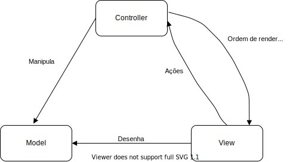
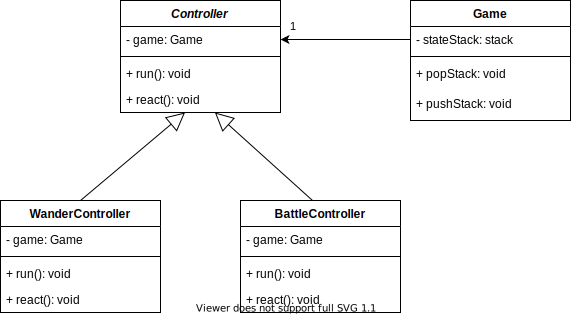

# **LPOO - Fallout: A post pandemic RPG**

# Tabela de Conteúdos
- [**LPOO - Fallout: A post pandemic RPG**](#lpoo---fallout-a-post-pandemic-rpg)
- [Tabela de Conteúdos](#tabela-de-conteúdos)
- [Funcionalidades](#funcionalidades)
  - [Implementadas](#implementadas)
  - [Por implementar](#por-implementar)
- [Design](#design)
  - [Padrão Arquitetural](#padrão-arquitetural)
    - [Contexto do problema](#contexto-do-problema)
    - [Design Pattern](#design-pattern)
    - [Implementação](#implementação)
    - [Consequências](#consequências)
  - [Atributos](#atributos)
    - [Contexto do Problema](#contexto-do-problema-1)
    - [Design Pattern](#design-pattern-1)
    - [Implementação](#implementação-1)
    - [Consequências](#consequências-1)
  - [Movimentação dos Personagens](#movimentação-dos-personagens)
    - [Contexto do problema](#contexto-do-problema-2)
    - [Design Pattern](#design-pattern-2)
    - [Implementação](#implementação-2)
    - [Consequências](#consequências-2)
  - [Diferentes Estados de Jogo](#diferentes-estados-de-jogo)
    - [Contexto do problema](#contexto-do-problema-3)
    - [Design Pattern](#design-pattern-3)
    - [Implementação](#implementação-3)
    - [Consequências](#consequências-3)
  - [Escolha do desenho das personagens](#escolha-do-desenho-das-personagens)
    - [Contexto do problema](#contexto-do-problema-4)
    - [Design pattern](#design-pattern-4)
    - [Implementação](#implementação-4)
    - [Consequências](#consequências-4)
  - [Estados distintos - Gráficos diferentes](#estados-distintos---gráficos-diferentes)
    - [Contexto do problema](#contexto-do-problema-5)
    - [Solução](#solução)
  - [Group Renderers](#group-renderers)
    - [Contexto do problema](#contexto-do-problema-6)
    - [Design Pattern](#design-pattern-5)
    - [Implementação](#implementação-5)
    - [Consequeências](#consequeências)
  - 

# Funcionalidades
  
## Implementadas
- Movimento do herói: o herói move-se pela arena e o seu movimento é controlado através de teclas do teclado
- Desenho do herói e da arena: a arena e os seus componentes (monstros e paredes), bem como o herói (Vault Boy), são desenhados no terminal do Lanterna
- Movimento dos monstros: os monstros movem-se na arena
- Deteção do inicio de batalha: quando o range do Vault Boy colide com o range de um monstro que esteja no seu campo de visão (sem paredes entre estes), a batalha inicia
- Ficheiros de jogo: carregamento da arena e outras informações através de ficheiros de jogo

## Por implementar
- Ecrã inicial: menu onde o jogador terá 6 pontos para distribuir pelos 4 atributos para poder criar o seu personagem
- Menu de Wander: menu onde o jogador poderá editar o seu equipamento e arma, percorrer o seu inventário e obter outro tipo de informações
- Modo de batalha: modo onde é efetuada uma batalha por turnos contra um (ou talvez mais) monstro.
- Loot: Sistema de *loot* para que o jogador possa apanhar diferentes armas (e possivelmente equipamento) para lutar com os inimigos que encontrará
- Equipamentos: sistema de armaduras e outros equipamente que darão atributos bónus ao personagem (e possivelmente aos monstros)
- NPCs: o jogador poderá interagir com um personagem não jogável para trocar o dinheiro ganho em batalha por novas armas e armaduras
- Transição entre arenas: existem mais do que uma arena e o jogador viaja entre elas através das suas portas
- Gravação de dados: o jogador pode guardar os dados da partida (em ficheiros) para que o jogo guarde o progresso

# Design

## Padrão Arquitetural
### Contexto do problema
O padrão arquitetural foi a primeira escolha feita no desenvolvimento do programa. A escolha do padrão arquitetural é de extrema importância porque dita a estrutura básica do programa.
### Design Pattern
Como padrão arquitetural decidimos seguir a recomendação e utilizar o MVC básico.
### Implementação

  

### Consequências
 - É mais fácil expandir o programa
 - É mais fácil testar os componenetes individuais. Por exemplo textar o model de forma isolada do controller.
 - É por vezes dificil compreender qual a responsabilidade de cada componente do MVC.

## Atributos
### Contexto do Problema
Tanto o nosso personagem quanto os monstros que enfrentará terão atributos que governarão a aptidão para o combate, a capacide de auto-cura, etc.
Estes atributos também serão partilhados com as armas, que poderão exigir um valor mínimo para serem manuseadas, e com os equipamentos, que terão os seus próprios atributos e funcionarão como boost aos atributos base das personagens.

### Design Pattern
A solução de este problema passou pela criação de uma classe ***Attributes*** que irá ter todos os atributos que os personagens podem possuir e que as armas podem exigir. Se uma arma não exigir um determinado atributo ou o personagem/equipamento não tiver um atributo, o seu valor é simplesmente zero. 

### Implementação

  

### Consequências
 - Respeito dos principios SOLID
 - Algumas armas e personagens (maioritariamente monstros) podem estar cientes de atributos que não possuem. Por exemplo, um monstro pode não ter inteligência e nesse caso o atributo está a zero quando podia não existir.

 

## Movimentação dos Personagens
### Contexto do problema
Queriamos dar suporte tanto a estratégias de movimentação alternativas para poder suportar movimentações que considerem, por exemplo, as posições relativas dos elementos na arena. Para além disso, queriamos tornar mais fácil a testagem da movimentação dos personagens.

### Design Pattern
Para resolver este problema decidimos utilizar o *Strategy Pattern*, para que o nosso EnemyController possa receber uma *engine* de movimentação arbitrária.

### Implementação

  

### Consequências
 - Respeito do Open closed principle. Para adicionar uma estratégia de movimento basta criar uma nova subclasse.
 - Respeito do Dependency inversion principle. O nosso EnemyController depende de uma interface que define MovingEngine.
 - Código mais fácil de testar. Podemos criar mocks deterministicos de MovingEngine para realizar testes.
 
 

## Diferentes Estados de Jogo
### Contexto do problema
O nosso jogo estará dividido em vários estados, cujo comportamento e aspeto deverá ser diferente. Há, portanto, necessidade do jogo se comportar manifestamente diferente consoante o estado, sendo que este se altera durante o funcionamento do jogo.

### Design Pattern
Para este efeito, decidimos implementar o *State Pattern*, com umas pequenas alterações: dada a necessidade de voltar a estados anteriores, implementámos uma *stack* no Game com os diferentes estados, sendo assim o state ativo aquele que se encontra no topo da mesma. Para podermos implementar os diferentes states, usámos generics, de modo a que estes suportem diferentes models.

### Implementação

  

### Consequências
- preservação do Single Responsability Principle: cada state tem a sua classe
- preservação o Open-Closed Principle: a adição de novos states não afeta os states já existentes
- evasão a *state machines* com condicionais complexos

 

## Escolha do desenho das personagens
### Contexto do problema
Apesar do nosso jogo não utilizar uma framework de gráficos complexa, existe a necessidade de diferenciar os inimigos para perceber, por exemplo, que arma utiliazam ou quão fortes são.
Foram estudadas várias soluções para o problema, como por exemplo utilizar uma variação do MVC, o HMVC.

### Design pattern
Para este problema decidimos utilizar uma solução própria. Criámos uma enumeração que contem os tipos de inimigos que podem existir esta enumeração está armazenada na classe **Enemy**. 
Para suportar esta forma de desenhar os inimigos cada **Viewer** terá um mapa que, para cada tipo de inimigo retorna a forma de o desenhar naquele **Viewer**.

### Implementação 

  

### Consequências
- Existe uma pequena violação do Open-Closed Principle, porque ao criar novos tipos de inimigos teriamos de alterar os viewers para os conseguir desenhar. No entanto, esta alternativa revelou ser a melhor entre todas as outras que considerámos
- Permite ter diferentes formas de desenhar os inimigos consoante o viewer que está a ser chamado

## Estados distintos - Gráficos diferentes
### Contexto do problema
O nosso jogo, como foi explicado anteriormente, pode ser dividido em vários estados. Em alguns, os requerimentos para a qualidade dos gráficos são diferentes: no estado Wander, semelhante à arena do hero, o tamanho dos componentes da cena permite que sejam representados apenas por simples carateres (chamemos a gráficos como estes **monocarater**); no entanto, no estado de batalha, consideramos que existe a necessidade de formar imagens de maior qualidade e formadas por vários carateres (designaremos estes gráficos como **multicarater**). Também havia a questão de como tornar estes dois estilos de gráficos diferentes minimamente agradáveis. 

### Solução
Decidimos que a melhor opção seria que o tamanho da letra e a resolução do terminal não poderiam ser as mesmas. Por esta razão, optámos por gerar um novo terminal no caso de entrada num modo que assim o necessite, com resolução e tamanho diferentes. Quanto à segunda fase do problema, e devido às limitações impostas pelo terminal a utilizar optámos por:
- recorrer ao uso de custom fonts para melhorar os gráficos **monocarater**
- formular imagens em formato ascii art através de conversores online no que toca aos gráficos **multicarater**. Escolhemos esta opção tendo em conta a sua relativa simplicidade mas decente qualidade.

## Group Renderers
### Contexto do problema
No modo de batalha, o desenho dos elementos da cena é mais complicado, dado que cada compomente é prefeito por múltiplos carateres. Para isto, foi criada a familia de classes **Renderer**. Um **SpriteRenderer** constrói um mapa de carateres e posições. Existem vezes em que queremos que o elemento represente apenas uma imagem, mas outras em que pretendemos que o elemento represente várias imagens. No entanto, seria desejável que o viwer responsável por desenhar os componentes da cena não tivesse que distinguir entre estes. 

### Design Pattern
Como solução para este problema foi implementado um Composite. Existe, então, uma classe **GroupRenderer** que contém uma list de renderers.

### Implementação

  

### Consequeências
- Simplifica o cliente, neste caso, o battleviewer

## 