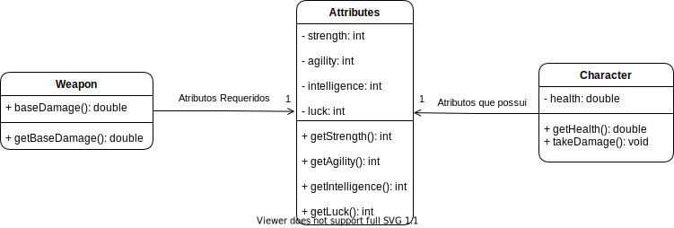
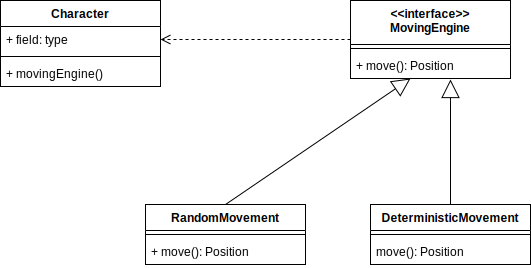

# LPOO - Fallout: A post pandemic RPG

## Tabela de Conteúdos
(Vai ser o índice)

## Design
### Atributos
#### Contexto do Problema
Tanto o nosso personagem quanto os monstros que enfrentará terão atributos que governarão a aptidão para o combate, a capacide de auto-cura, etc.
Estes atributos também serão partilhados com as armas, que poderão exigir um valor mínimo para serem manuseadas.

#### _Design Pattern_
A solução de este problema passou pela criação de uma classe **_Attributes_** que irá ter todos os atributos que os personagens podem possuir e que as armas podem exigir. Se uma arma não exigir um determinado atributo ou o personagem não tiver um atributo, o seu valor é simplesmente zero. 
#### Implementação

  

#### Consequências
 - Respeito dos principios SOLID
 - Algumas armas e personagens (maioritariamente monstros) podem estar cientes de atributos que não possuem. Por exemplo, um monstro pode não ter inteligência e nesse caso o atributo está a zero quando podia não existir.

### Movimentação dos Personagens
#### Contexto do problema
O nosso personagem e os monstros vão ter estratégias de movimentação. Como a movimentação dos monstros é maioritáriamente aleatória produzir bons testes para as funções que lidam com movimentação poderia ser difícil.
#### _Design Pattern_
Para resolver este problema decidimos utilizar o _Strategy Pattern_ para que a estratégia de movimentação não faça parte dos monstros e possa ser manipulada para efeitos de teste.
#### Implementação

  

#### Consequências
 - Respeito do Open closed principle. Para adicionar uma estratégia de movimento basta criar uma nova subclasse. 
 - Código mais fácil de testar

### Diferentes Estados de Jogo
#### Contexto do problema
O nosso jogo estará dividido em vários estados, cujo comportamento e aspeto deverá ser diferente. Como tal, estes diferentes estados deveriam ser controlados por diferentes Controllers.